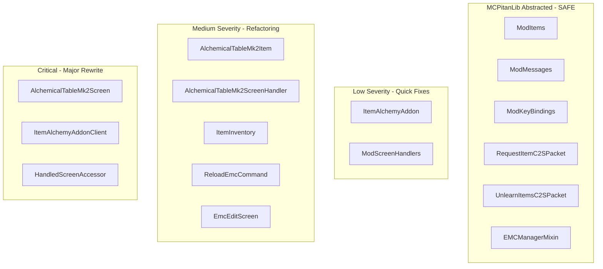

# Cross-Version Compatibility Audit for ItemAlchemyAddon

## Verdict

**The mod cannot currently run across versions 1.18.1 to 26.1.2.** There are approximately **60+ direct Minecraft/Fabric API usages** spread across 10 of 17 source files that would break on different MC versions. However, the core architecture (registration, networking, commands) is already well-written using MCPitanLib. The main problem is concentrated in 4 files, with `AlchemicalTableMk2Screen.java` being the largest challenge.

---

## File-by-File Breakdown

### Already Compatible (no changes needed)
- [ModMessages.java](src/main/java/pl/viko/itemalchemyaddon/networking/ModMessages.java) — Uses `ServerNetworking`, `CompatIdentifier` only
- [ModKeyBindings.java](src/client/java/pl/viko/itemalchemyaddon/util/ModKeyBindings.java) — Uses `CompatKeyBinding`, `KeybindingRegistry` only
- [ModItems.java](src/main/java/pl/viko/itemalchemyaddon/item/ModItems.java) — Uses `RegistryResult`, `CompatibleItemSettings`, `CreativeTabBuilder`
- [RequestItemC2SPacket.java](src/main/java/pl/viko/itemalchemyaddon/networking/packet/RequestItemC2SPacket.java) — Uses `PacketByteUtil`, MCPitanLib's `Player`, `ItemStackUtil`
- [UnlearnItemsC2SPacket.java](src/main/java/pl/viko/itemalchemyaddon/networking/packet/UnlearnItemsC2SPacket.java) — Same as above
- [EMCManagerMixin.java](src/main/java/pl/viko/itemalchemyaddon/mixin/EMCManagerMixin.java) — Targets ItemAlchemy, uses MCPitanLib's `ServerWorld`

### SEVERITY: LOW (quick fixes, ~30 min total)

**1. [ItemAlchemyAddon.java](src/main/java/pl/viko/itemalchemyaddon/ItemAlchemyAddon.java)**
- Uses `ExtendModInitializer` (Fabric-only) instead of `CommonModInitializer` (cross-version)
- Fix: Change `extends ExtendModInitializer` to `extends CommonModInitializer`, update import

**2. [ModScreenHandlers.java](src/main/java/pl/viko/itemalchemyaddon/screen/ModScreenHandlers.java)**
- The lambda `e -> new AlchemicalTableMk2ScreenHandler(e.syncId, e.playerInventory)` works but should pass the whole `CreateMenuEvent` once the ScreenHandler is refactored
- Fix: Change to `AlchemicalTableMk2ScreenHandler::new` after ScreenHandler refactor

### SEVERITY: MEDIUM (significant refactoring, ~4 hours total)

**3. [AlchemicalTableMk2Item.java](src/main/java/pl/viko/itemalchemyaddon/item/AlchemicalTableMk2Item.java) — 8 vanilla API calls**

Current (version-breaking):
```java
public class AlchemicalTableMk2Item extends CompatItem implements NamedScreenHandlerFactory {
    public TypedActionResult<ItemStack> use(World world, PlayerEntity user, Hand hand) {
        user.openHandledScreen(this);
        return TypedActionResult.consume(user.getStackInHand(hand));
    }
    public ScreenHandler createMenu(int syncId, PlayerInventory inv, PlayerEntity player) { ... }
}
```

Should be (cross-version, matching ExampleGuiItem pattern):
```java
public class AlchemicalTableMk2Item extends CompatItem implements SimpleScreenHandlerFactory {
    public StackActionResult onRightClick(ItemUseEvent e) {
        if (!e.isClient()) e.user.openGuiScreen(this);
        return e.success();
    }
    public ScreenHandler createMenu(CreateMenuEvent e) {
        return new AlchemicalTableMk2ScreenHandler(e);
    }
}
```

Breaking APIs: `TypedActionResult` (renamed/removed in newer MC), `NamedScreenHandlerFactory`, `use(World, PlayerEntity, Hand)`, `openHandledScreen()`, `getStackInHand()`, `getDisplayName()`, `Text.translatable()`

**4. [AlchemicalTableMk2ScreenHandler.java](src/main/java/pl/viko/itemalchemyaddon/screen/AlchemicalTableMk2ScreenHandler.java) — 6 vanilla API calls**

Breaking APIs:
- Constructor takes `(int syncId, PlayerInventory)` instead of `CreateMenuEvent`
- `ArrayPropertyDelegate` / `PropertyDelegate` — direct MC screen handler internals
- `onButtonClick(PlayerEntity player, int id)` — vanilla method signature with `PlayerEntity`
- `MinecraftServer` direct usage in `burnItems()`

Fix: Refactor constructor to accept `CreateMenuEvent`, investigate if MCPitanLib has a property delegate abstraction (it may not — this could need version-conditional wrapping or a custom sync approach).

**5. [ItemInventory.java](src/main/java/pl/viko/itemalchemyaddon/item/ItemInventory.java) — 6 vanilla API calls**

Breaking APIs:
- `stack.getOrCreateNbt()` and `stack.setNbt()` — **Removed entirely in MC 1.20.5+** (replaced by Data Components)
- `Inventories.readNbt()` / `Inventories.writeNbt()` — signature changes
- `NbtCompound` direct usage

This file may not even be actively used (no references found in the active code flow). If it's dead code, it should be removed. If needed, MCPitanLib likely provides `NbtUtil` or similar abstractions.

**6. [ReloadEmcCommand.java](src/main/java/pl/viko/itemalchemyaddon/command/ReloadEmcCommand.java) — 8 vanilla API calls**

Breaking APIs:
- `RecipeType.CRAFTING/SMELTING/BLASTING/SMOKING/CAMPFIRE_COOKING` — direct MC enum (API changed in 1.20.2+)
- `recipeManager.toMinecraft().listAllOfType(...)` — bypasses MCPitanLib abstraction, exposes version-specific recipe manager
- `r.getId()` — changed in 1.20.2+ (recipes wrapped in `RecipeEntry`)
- `Ingredient` and `IngredientUtil.getMatchingStacks()` — API changes
- `RegistryLookupUtil.getRegistryLookup()` — version-sensitive

Fix: Use MCPitanLib's `ServerRecipeManager` and `RecipeEntry` wrappers consistently. Avoid `.toMinecraft()` calls.

**7. [EmcEditScreen.java](src/client/java/pl/viko/itemalchemyaddon/screen/EmcEditScreen.java) — 4 vanilla API calls**

Breaking APIs:
- `this.client.player.networkHandler.sendChatCommand(command)` — didn't exist before 1.19.1 (was `sendCommand()`)
- `net.minecraft.client.gui.screen.Screen` import
- `TextFieldWidget` direct import

Fix: Use MCPitanLib's command execution utilities if available, or wrap in a version-conditional helper.

### SEVERITY: CRITICAL (major rewrite, ~1-2 days)

**8. [AlchemicalTableMk2Screen.java](src/client/java/pl/viko/itemalchemyaddon/screen/AlchemicalTableMk2Screen.java) — ~30+ vanilla/Fabric API calls**

This is by far the biggest problem. It contains direct calls to APIs that changed dramatically across MC versions:

| API Call | Introduced/Changed | Impact |
|----------|-------------------|--------|
| `PacketByteBufs.create()` | Fabric API, removed in newer versions | Networking broken |
| `DrawContext` (all methods) | Added in 1.20, doesn't exist in 1.18/1.19 | Rendering broken |
| `ItemGroup` / `ItemGroups.getGroups()` | Overhauled in 1.19.3 | Tab system broken |
| `ItemGroup.Type.SEARCH/HOTBAR/INVENTORY` | 1.19.3+ enum | Tab filtering broken |
| `group.getDisplayStacks()` / `group.getIcon()` | 1.19.3+ API | Item lists broken |
| `Registries.ITEM.forEach()` | Was `Registry.ITEM` before 1.19.3 | Item enumeration broken |
| `TextFieldWidget` constructor | Changed between versions | Search broken |
| `context.enableScissor()`/`disableScissor()` | `DrawContext` method (1.20+) | Clipping broken |
| `context.drawItem()` / `fill()` / `drawTooltip()` | `DrawContext` methods (1.20+) | All rendering broken |
| `context.getMatrices().push()/translate()` | Works but accessed through DrawContext | Z-ordering broken |
| `this.client.interactionManager.clickButton()` | Direct MC client internals | Button clicks broken |
| `hasShiftDown()` | `Screen` method | Input detection |
| `getTooltipFromItem()` | `Screen` method, signature varies | Tooltips broken |

The MCPitanLib examples only show extremely simple screens (a texture + one button via `CompatibleTexturedButtonWidget`). Your screen has:
- Custom item grid with scrolling and scissoring
- Tab system with custom rendering
- Search field
- Multiple overlay effects (transparency, cross icons)
- Complex mouse interaction (drag selection, scrollbar grab offset)
- Direct packet sending from the screen

**What MCPitanLib provides for rendering** (based on your code and examples):
- `SimpleHandledScreen` / `CompatInventoryScreen` — base classes ✓
- `RenderUtil.RendererUtil.drawTexture()` — texture drawing ✓
- `RenderArgs`, `DrawBackgroundArgs` with `drawObjectDM` — abstracted draw context ✓

**What MCPitanLib likely does NOT provide** (no evidence in examples):
- Cross-version `DrawContext.fill()` equivalent
- Cross-version `DrawContext.drawItem()` equivalent
- Cross-version `DrawContext.enableScissor()`/`disableScissor()`
- Cross-version `DrawContext.drawTooltip()`
- Cross-version `ItemGroup` enumeration
- Cross-version `TextFieldWidget` creation
- Cross-version `PacketByteBuf` creation for client-side sending

**9. [ItemAlchemyAddonClient.java](src/client/java/pl/viko/itemalchemyaddon/client/ItemAlchemyAddonClient.java) — 6 Fabric-only API calls**

Breaking APIs:
- `ClientModInitializer` interface — Fabric-only (NeoForge has different entry point)
- `ScreenEvents.AFTER_INIT` — Fabric Screen API
- `ScreenKeyboardEvents.beforeKeyRelease()` — Fabric Screen API
- `client.mouse.getX()` / `client.getWindow().getScaleFactor()` — Direct MC client internals

Fix: MCPitanLib may have a cross-version client initializer. The screen event hooks are harder — there may be no MCPitanLib equivalent for intercepting key events on arbitrary screens.

**10. [HandledScreenAccessor.java](src/client/java/pl/viko/itemalchemyaddon/mixin/HandledScreenAccessor.java)**

- `@Mixin(HandledScreen.class)` with `@Invoker("getSlotAt")` — Method name depends on mappings and version. Intermediary mappings should help, but this is inherently fragile.

---

## Architecture Diagram: Version-Dependency Map



---

## Estimated Effort to Achieve Full Cross-Version Compatibility

| Category | Files | Estimated Time |
|----------|-------|---------------|
| Already compatible | 6 files | 0 |
| Low severity | 2 files | ~30 minutes |
| Medium severity | 5 files | ~4-6 hours |
| Critical (Screen) | 1 file (815 lines) | ~1-2 days |
| Critical (Client init + Mixin) | 2 files | ~2-4 hours |
| **Total** | **16 files** | **~2-3 days** |

**However**, there is a major unknown: MCPitanLib may not provide abstractions for everything the Screen needs (item grid rendering, scissoring, fill overlays, item group enumeration, text fields). You would need to either:
1. Check MCPitanLib's actual API for cross-version rendering utilities beyond what the examples show
2. Request Pitan to add missing abstractions to MCPitanLib
3. Write your own version-conditional wrapper layer

---

## Regarding Switching to 1.20.2

Changing `gradle.properties` to target 1.20.2 would require:
- `minecraft_version=1.20.2`
- Updated `yarn_mappings` for 1.20.2
- Updated `fabric_version` for 1.20.2
- Updated `mcpitanlib_version` to `1.20.2:x.x.x` (must check what version exists)
- Updated `itemalchemy_version` (must check compatibility)

The code **will not compile** on 1.20.2 without fixes because the Recipe API changed (RecipeEntry wrapper). The `ReloadEmcCommand.java` file directly calls `.toMinecraft().listAllOfType()` with raw types that changed.

---

## Recommended Approach

1. **Phase 1 — Fix the easy wins**: Refactor `AlchemicalTableMk2Item`, `ItemAlchemyAddon`, `ModScreenHandlers` to use MCPitanLib patterns (matching the examples exactly)
2. **Phase 2 — Refactor ScreenHandler**: Convert constructor to `CreateMenuEvent`, investigate PropertyDelegate cross-version support
3. **Phase 3 — Investigate MCPitanLib rendering API**: Before rewriting the Screen, we need to know what rendering utilities MCPitanLib actually provides for `drawItem`, `fill`, `scissor`, `drawTooltip`, and `ItemGroup` enumeration across versions
4. **Phase 4 — Rewrite the Screen**: The largest task, depends on Phase 3 findings
5. **Phase 5 — Test on 1.20.2**: Change gradle config and fix remaining compilation errors
